<div align="center">

# 🧠 ADHDapt

### The calmer system for the ADHD brain.

A full-stack, AI-assisted wellbeing workspace that replaces the "one giant todo list" with
small, forgiving surfaces: mood check-ins, journaling, task breakdowns, a gentle day
scheduler, focus games, and a realtime peer community.

<br/>


</div>

---

## 📑 Table of Contents

- [Why ADHDapt](#-why-adhdapt)
- [Feature Tour](#-feature-tour)
- [System Architecture](#-system-architecture)
- [Route Map](#-route-map)
- [Data Model](#-data-model)
- [Key Flows](#-key-flows)
  - [Auth: Clerk → Supabase RLS](#1-auth-clerk--supabase-rls)
  - [AI Day Scheduler](#2-ai-day-scheduler)
  - [Realtime Community](#3-realtime-community)
  - [Journal Media Upload](#4-journal-media-upload)
  - [Local → Cloud Migration](#5-local--cloud-migration)
- [Getting Started](#-getting-started)
- [Environment Variables](#-environment-variables)
- [Project Structure](#-project-structure)
- [Scaling Playbook](#-scaling-playbook)
- [Roadmap](#-roadmap)

---

## 💡 Why ADHDapt

Generic productivity tools assume a brain that reliably estimates time, sustains attention,
and finds intrinsic reward in finishing things. ADHDapt assumes the opposite and designs
around it:

| ADHD friction | What ADHDapt does |
| --- | --- |
| **Task paralysis** — the task is too big to start | AI **task breakdown** turns one intimidating title into checkable subtasks |
| **Time blindness** — everything is "now" or "not now" | **Scheduler** with visible time blocks + an AI "gentler reorder" pass |
| **Emotional flooding** with no record | 5-point **mood check-ins** with a streak, charted over time |
| **Working memory leaks** | **Journal** with rich text, prompts, collections, and image/video attachments |
| **Dopamine drought** | **Focus Fest** arcade — three attention/memory games |
| **Isolation & shame** | **Community** — realtime general feed, subtype rooms, and 1:1 DMs |
| **Burnout after hyperfocus** | AI **break advice** tuned to the task you just finished |

Three onboarding roles — `individual`, `parent`, `therapist` — shape the shell that wraps
every surface.

---

## ✨ Feature Tour

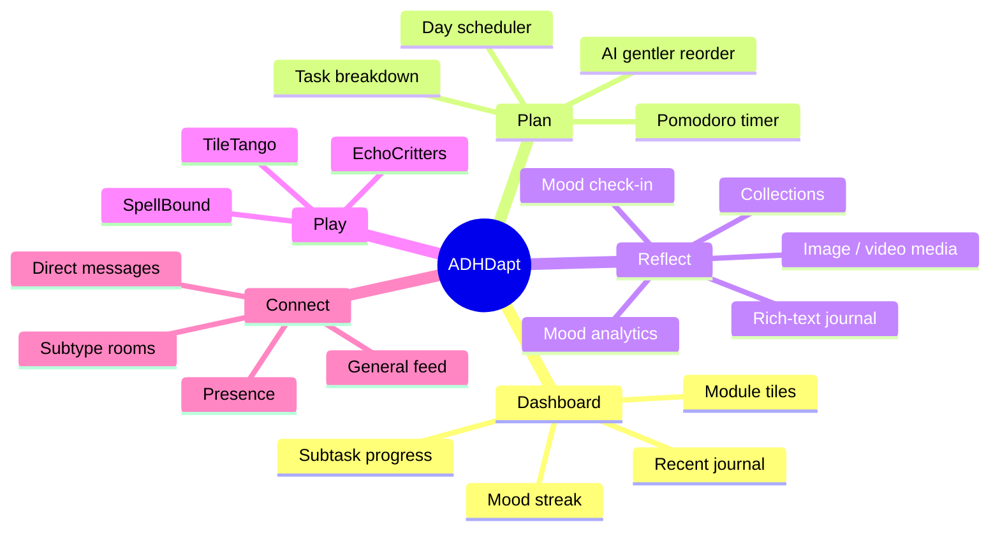

---

## 🏛 System Architecture

A single Next.js App Router deployment. There is no separate API server — server work
lives in Route Handlers, and data access happens **directly from the browser** to Supabase
using a Clerk-signed JWT, so Postgres RLS is the authorization boundary.

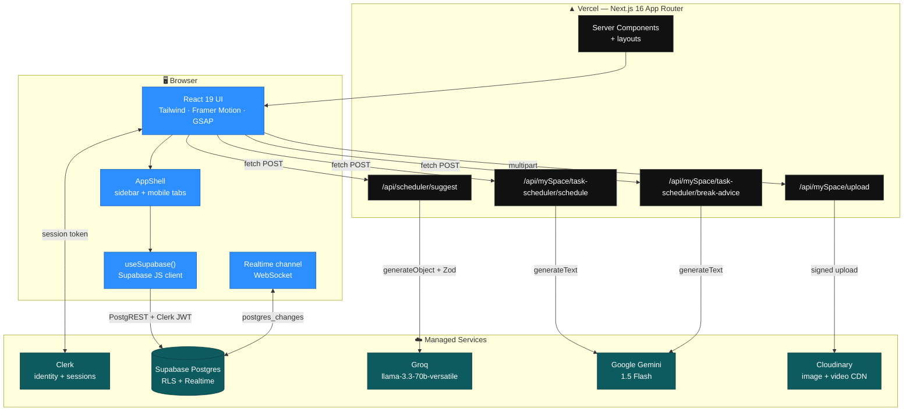

### Why the API surface is so small

Only four Route Handlers exist, and every one of them exists for exactly one reason:
**it holds a secret the browser must never see.**

| Route | Secret it protects | Model / service |
| --- | --- | --- |
| `POST /api/scheduler/suggest` | `GROQ_API_KEY` | Groq · `llama-3.3-70b-versatile` · structured output via Zod |
| `POST /api/mySpace/task-scheduler/schedule` | `GOOGLE_GENERATIVE_AI_API_KEY` | Gemini 1.5 Flash |
| `POST /api/mySpace/task-scheduler/break-advice` | `GOOGLE_GENERATIVE_AI_API_KEY` | Gemini 1.5 Flash |
| `POST /api/mySpace/upload` | `CLOUDINARY_API_SECRET` | Cloudinary signed upload |

Everything else — moods, journal, tasks, schedule, settings, chat — is plain CRUD and goes
straight from the client to Postgres. No handler to maintain, no cold start, no extra hop.

---

## 🗺 Route Map

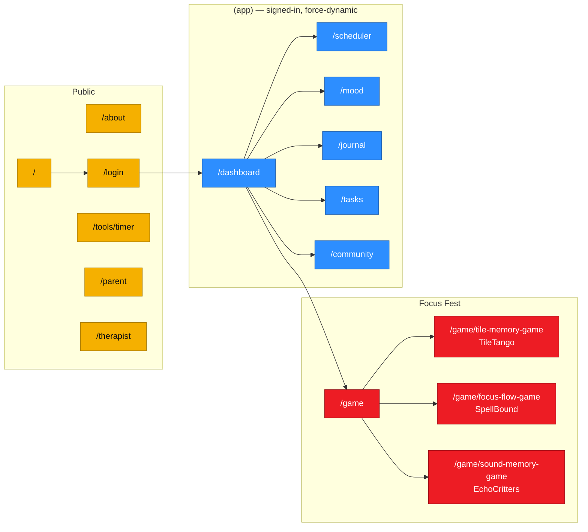

The `(app)` route group is wrapped by [`AppShell`](src/components/myspace/AppShell.tsx) and
marked `force-dynamic` — these are per-user surfaces that must never be statically
prerendered (Clerk's `useUser` has no provider at build time).

---

## 🗄 Data Model

All rows are keyed by the **Clerk user id** (a `text` id like `user_2xyz…`), not a Supabase
auth uuid. RLS policies read `auth.jwt()->>'sub'` to enforce ownership.

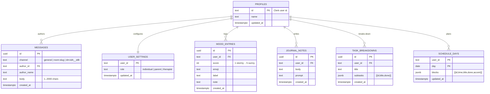

### The channel namespace trick

One `messages` table serves three very different chat products, discriminated by a string:

| Pattern | Meaning | Example |
| --- | --- | --- |
| `general` | The public firehose | `general` |
| `room:<slug>` | A public subtype room | `room:time-blind` |
| `dm:<idA>__<idB>` | A 1:1 DM, ids lexically sorted | `dm:user_abc__user_xyz` |

Sorting the two ids means a DM channel name is **deterministic from either side** — no join
table, no conversation row, no "who started it" bookkeeping. A single composite index
`(channel, created_at)` serves every read path.

> ⚠️ `supabase/schema.sql` ships **permissive** policies (public read/insert) so the general
> feed and rooms work before the Clerk↔Supabase JWT integration is wired up. DMs are
> filtered client-side in that mode. See [Scaling Playbook → Harden RLS](#phase-1--harden-the-boundary).

---

## 🔀 Key Flows

### 1. Auth: Clerk → Supabase RLS

The interesting architectural decision. Rather than proxying every query through a Next.js
handler with a service-role key, the browser gets a Supabase client whose `accessToken`
callback mints a fresh **Clerk** session token on each request.

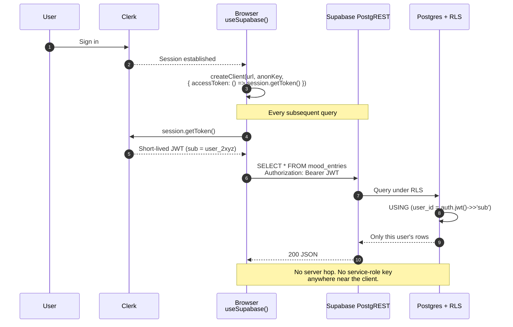

**Why this matters at scale:** every read/write skips the serverless function entirely.
No cold starts, no function invocation cost, no per-request compute — Supabase's connection
pooler absorbs the load. The tradeoff is that *RLS is the only thing standing between users*,
so those policies must be exactly right.

### 2. AI Day Scheduler

The scheduler's "suggest a gentler order" button is the app's flagship AI touch. It uses
**structured generation** (`generateObject` + a Zod schema) so the model physically cannot
return prose that breaks the UI.

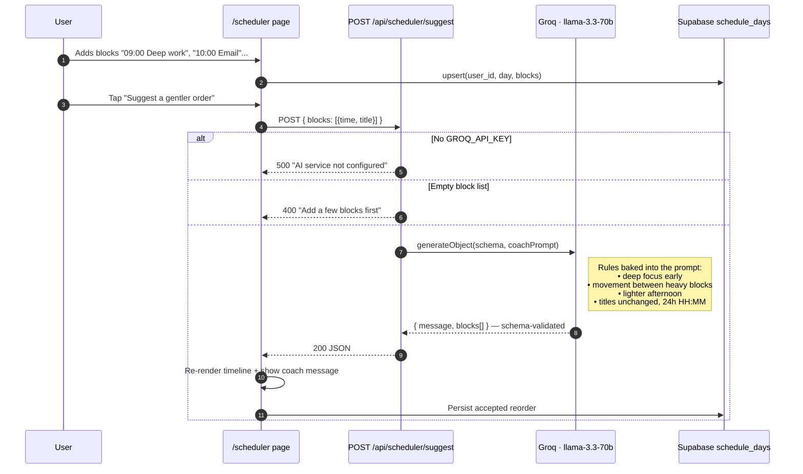

The schema pins the contract:

```ts
z.object({
  message: z.string(),                    // one warm sentence, ≤ ~30 words
  blocks: z.array(z.object({
    title: z.string(),                    // unchanged from input
    time:  z.string(),                    // 24h HH:MM
  })),
})
```

A parallel Gemini-backed flow at `/api/mySpace/task-scheduler/schedule` handles the richer
case — tasks carrying `estimatedDuration`, `priority`, and `preferredTimeSlot` get packed
into their preferred windows rather than back-to-back.

### 3. Realtime Community

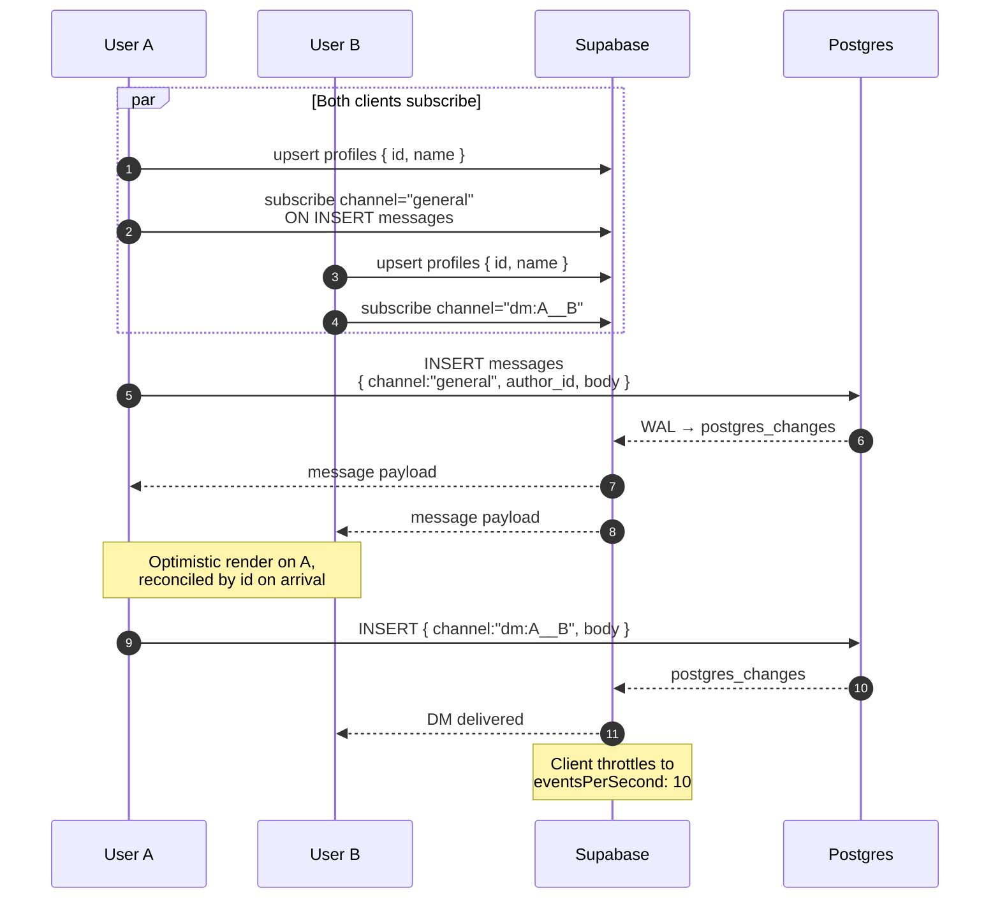

Presence and the user directory come from the `profiles` table, upserted on every sign-in —
so the DM picker is just `SELECT * FROM profiles`.

### 4. Journal Media Upload

Cloudinary signing happens server-side; the secret never ships to the browser. The handler
computes the SHA-1 signature with the **Web Crypto API**, so it runs anywhere — Node or Edge.

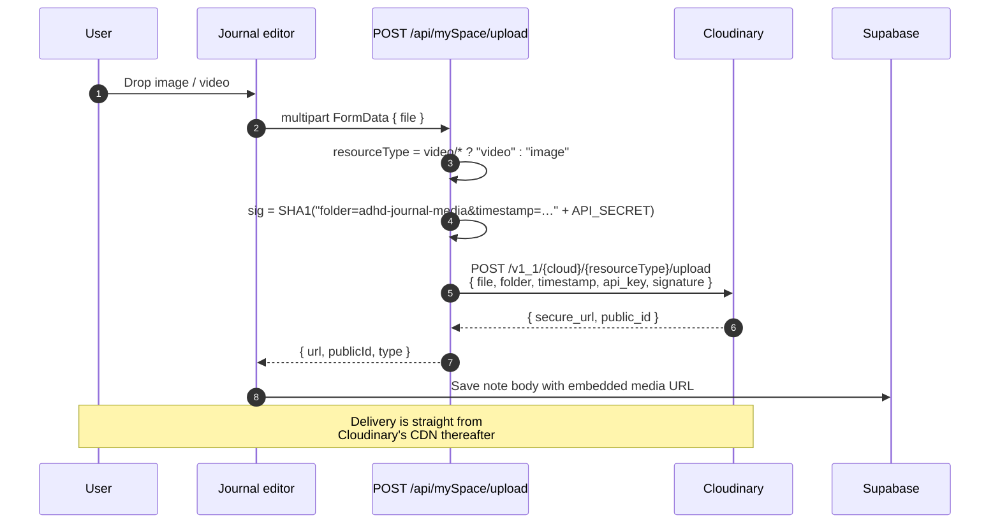

### 5. Local → Cloud Migration

ADHDapt shipped localStorage-first. When a returning user signs in, their old data is
lifted into Postgres exactly once.

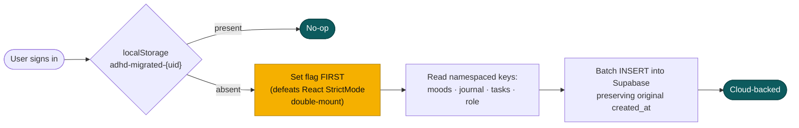

Setting the flag *before* the inserts is deliberate: StrictMode mounts effects twice in
development, and a flag set afterwards would duplicate every row.

---

## 🚀 Getting Started

### Prerequisites

- **Node.js 20+**
- A **Clerk** application
- A **Supabase** project
- API keys for **Groq**, **Google Generative AI**, and **Cloudinary** (optional — the app
  degrades gracefully without them)

### Install & run

```bash
git clone https://github.com/satyansh911/adhdapt-v3.git
cd adhdapt-v3
npm install

cp .env.example .env.local   # then fill in the values below

npm run dev                  # http://localhost:3000
```

### Database setup

```bash
# Supabase Dashboard → SQL Editor → paste and run:
supabase/schema.sql
```

That creates `profiles` and `messages` plus their Realtime publication. The per-user tables
(`mood_entries`, `journal_notes`, `task_breakdowns`, `schedule_days`, `user_settings`) are
described in [Data Model](#-data-model) — create them with matching column names and add
owner-scoped RLS policies:

```sql
create policy "own rows" on public.mood_entries
  for all using (user_id = auth.jwt()->>'sub')
       with check (user_id = auth.jwt()->>'sub');
```

### Enable the Clerk ↔ Supabase bridge

1. **Clerk Dashboard** → enable the Supabase integration.
2. **Supabase Dashboard** → Authentication → add Clerk as a **Third-Party Auth** provider.
3. Tighten `supabase/schema.sql`'s permissive policies to check `auth.jwt()->>'sub'`.

Without this, `useSupabase()` still returns a client, but RLS sees no subject — which is
why the shipped policies are permissive.

### Scripts

| Command | Does |
| --- | --- |
| `npm run dev` | Dev server with Turbopack |
| `npm run build` | Production build |
| `npm start` | Serve the production build |
| `npm run lint` | ESLint |
| `ANALYZE=true npx next build` | Bundle treemaps into `.next/analyze` |

> **Note:** `next.config.ts` sets `typescript.ignoreBuildErrors: true` to work around a
> malformed generated `routes.d.ts` in Next 16.2.1's Turbopack. The source itself
> type-checks cleanly — run `npx tsc --noEmit` in CI for real type safety.

---

## 🔑 Environment Variables

| Variable | Required | Purpose |
| --- | :---: | --- |
| `NEXT_PUBLIC_CLERK_PUBLISHABLE_KEY` | ✅ | Clerk client. Absent → app renders without `ClerkProvider` |
| `CLERK_SECRET_KEY` | ✅ | Clerk server-side |
| `NEXT_PUBLIC_SUPABASE_URL` | ✅ | Supabase project URL |
| `NEXT_PUBLIC_SUPABASE_ANON_KEY` | ✅ | Supabase anon key — safe to expose, RLS does the work |
| `GROQ_API_KEY` | ⬜ | Scheduler "gentler order" suggestions |
| `GOOGLE_GENERATIVE_AI_API_KEY` | ⬜ | Task scheduling + break advice |
| `CLOUDINARY_CLOUD_NAME` | ⬜ | Journal media |
| `CLOUDINARY_API_KEY` | ⬜ | Journal media |
| `CLOUDINARY_API_SECRET` | ⬜ | Journal media — **server only** |
| `NEXT_PUBLIC_SITE_URL` | ⬜ | Canonical URL for OG metadata |
| `ANALYZE` | ⬜ | `true` to emit bundle treemaps |

Every optional key is guarded — a missing one returns a clean `500 "AI service not
configured"` rather than crashing, and `isSupabaseConfigured` lets the UI show an offline
state instead of a blank screen.

---

## 📁 Project Structure

```
src/
├── app/
│   ├── (app)/                  # Signed-in shell — force-dynamic
│   │   ├── dashboard/          # Streak, subtask progress, module tiles
│   │   ├── scheduler/          # Day timeline + AI reorder
│   │   ├── mood/               # 5-point check-in + analytics
│   │   ├── journal/            # TipTap rich text + media
│   │   ├── tasks/              # Task → subtask breakdown
│   │   └── community/          # Realtime feed, rooms, DMs
│   ├── (pages)/
│   │   ├── game/               # Focus Fest arcade — 3 games
│   │   ├── about · login · parent · therapist · tools/timer
│   │   └── _legacy-*/          # Pre-refactor surfaces, kept for reference
│   └── api/                    # The 4 secret-holding route handlers
├── components/
│   ├── myspace/                # AppShell, RoleShell
│   ├── landing/                # Hero, BrainSection, AdhdWorldMap, ...
│   ├── journal/                # Editor, collections, mood dashboard
│   ├── pomodoro/ · task-scheduler/ · media/ · animations/
│   └── ui/                     # Design system + arcade iconography
├── hooks/
│   ├── use-supabase.ts         # Clerk-authed Supabase client
│   ├── use-role.ts             # Persisted onboarding role
│   └── use-toast.ts
├── lib/
│   ├── db.ts                   # Every Supabase query, one place
│   ├── myspace-storage.ts      # localStorage fallback + shared types
│   ├── migrate-local.ts        # One-time local → cloud lift
│   └── utils.ts
└── types/                      # journal.ts, task.ts
supabase/schema.sql             # profiles + messages + Realtime
```

---

## 📈 Scaling Playbook

Today's shape — a single Vercel deployment plus Supabase — comfortably serves the low tens
of thousands of users. Here's what breaks first, and in what order to fix it.

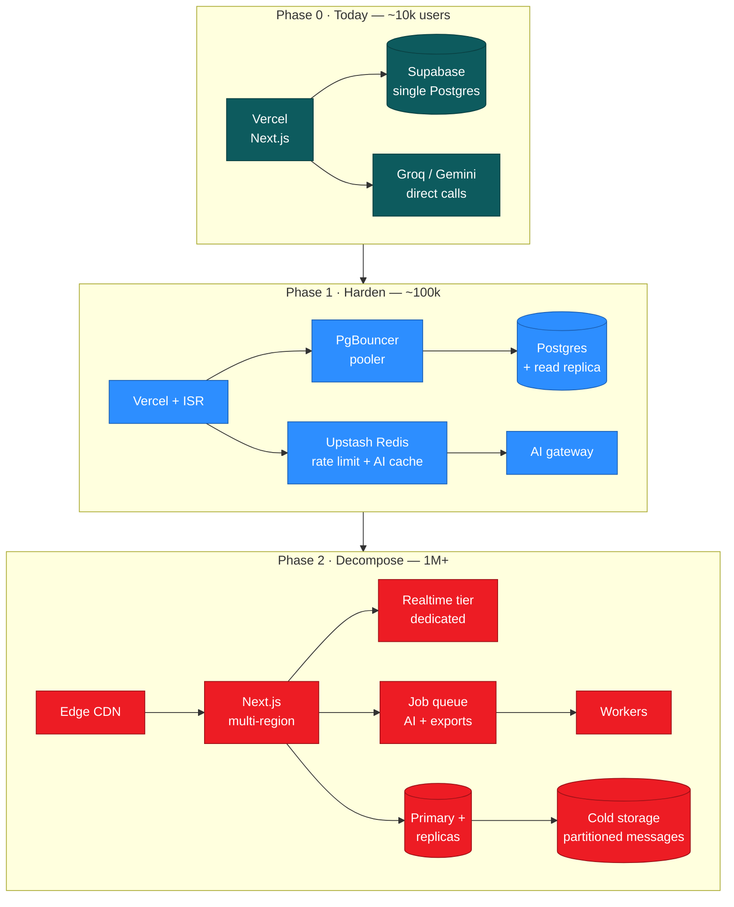

### Phase 1 — Harden the boundary

| Concern | Action |
| --- | --- |
| **RLS is the only wall** | Finish the Clerk↔Supabase JWT integration and replace `using (true)` with `user_id = auth.jwt()->>'sub'`. This is the single highest-value change in the repo. |
| **DM privacy** | DMs are currently filtered client-side. Move to a policy: `channel like 'dm:%' and auth.jwt()->>'sub' = any(string_to_array(replace(channel,'dm:',''), '__'))`. |
| **AI cost & abuse** | No rate limiting exists on the four AI routes. Add Upstash Redis sliding-window limits keyed by Clerk user id, plus a short TTL cache on `break-advice` (identical `taskName` + `timeOfDay` → identical answer). |
| **Connection exhaustion** | Browser-direct Postgres means one connection per active client. Route through Supabase's transaction-mode pooler before ~500 concurrent users. |
| **Cloudinary bandwidth** | Move to **client-side signed direct upload** — the server hands back a signature, the file never transits the function. Cuts function bandwidth to ~zero and removes the 4.5 MB serverless body cap. |

### Phase 2 — Decompose

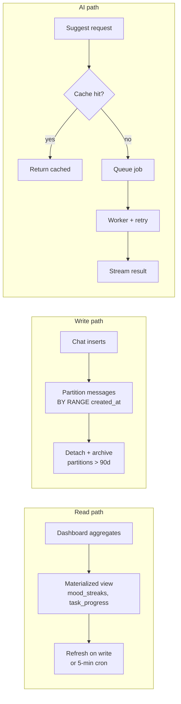

- **Messages table growth.** `messages` is the only unbounded table. Range-partition it by
  `created_at`, keep the hot partition indexed on `(channel, created_at)`, detach old ones to
  cheap storage. A public general feed at 1M users generates on the order of 10⁸ rows/year.
- **Realtime fan-out.** Supabase Realtime broadcasts every `general` insert to every
  subscriber — that's O(N²) at scale. Shard `general` into geographic or interest-based
  channels, and cap subscribers per channel.
- **Dashboard aggregates.** [`dashboard/page.tsx`](src/app/(app)/dashboard/page.tsx) pulls
  full mood/task/journal lists and reduces client-side. Replace with a materialized view or
  a Postgres function returning just the counters.
- **AI as async jobs.** Long generations (multi-chapter schedules) should return a job id
  and stream results rather than holding a serverless function open.
- **Bundle weight.** GSAP + Framer Motion + Lottie + Recharts + react-simple-maps is a lot
  of client JS. `ANALYZE=true npx next build` is already wired up — dynamic-import the map
  and Lottie players, and move the landing animations behind `next/dynamic`.

### Cost levers, cheapest first

1. Cache `break-advice` responses — high hit rate, near-identical inputs.
2. Serve Cloudinary derivatives (`f_auto,q_auto`) instead of originals.
3. Route the scheduler to Groq (already done — it's ~10× cheaper than Gemini Pro per token
   at comparable quality for this task).
4. ISR the marketing pages; keep `force-dynamic` scoped to `(app)` only.

---

## 🗺 Roadmap

- [ ] Complete Clerk↔Supabase JWT integration and tighten every RLS policy
- [ ] Rate limiting on all AI routes
- [ ] Ship the missing tables into `supabase/schema.sql` (only `profiles` + `messages` are in there today)
- [ ] Direct-to-Cloudinary signed uploads
- [ ] Materialized dashboard aggregates
- [ ] Parent and therapist surfaces beyond the marketing pages
- [ ] Remove `typescript.ignoreBuildErrors` once the Turbopack `routes.d.ts` bug is fixed upstream
- [ ] Retire the `(pages)/_legacy-*` routes

---

<div align="center">

**Built for brains that work differently.**

[Report a bug](https://github.com/satyansh911/adhdapt-v3/issues) · [Request a feature](https://github.com/satyansh911/adhdapt-v3/issues)

</div>
